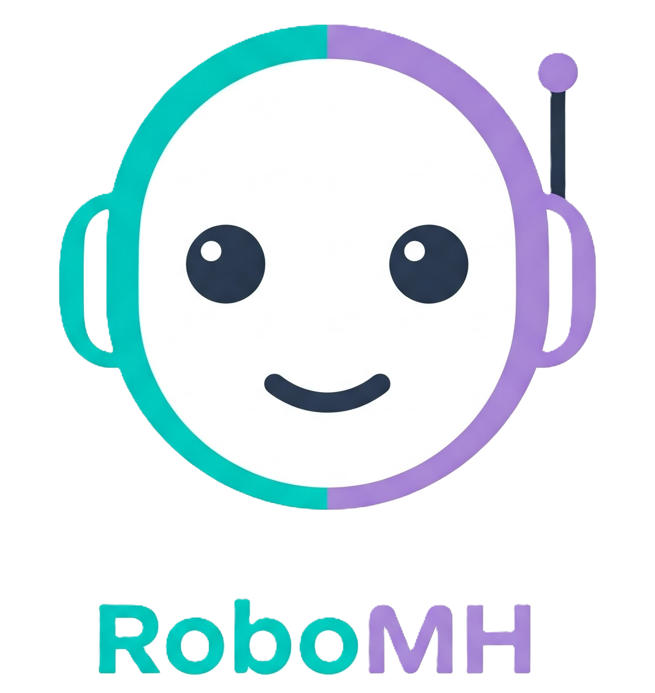

# AI-powered mental health chatbot & mood analysis.

## 🌟 Overview
This project is a **Mental Health & Emotion Analysis System** that:
- Detects emotions from uploaded facial images.
- Asks the user mental health-related questions.
- Generates a therapist-style mental health report.
- Provides **personalized suggestions** for well-being.
- Includes **voice input (speech-to-text)** for ease of use.
- Features **background music** for a calm user experience.
- Allows users to **download a PDF report**.

## 🚀 Features
✅ **Emotion Recognition** from user-uploaded images  
✅ **Mental Health Questionnaire** (8 questions)  
✅ **Speech-to-Text Input** for answering questions  
✅ **Interactive Therapist Insights & Suggestions**  
✅ **Downloadable PDF Report**  
✅ **Engaging UI with Background Music**  

## 🏗️ Project Structure

## New Goals
- Create a Robo Avatar with voice over
- Allow selection of Male vs Female
- The Robo will behave like a Doctor and will ask question in the form of voice
- Answers will be captured in the recorded video and audio
- The Video will create collage image
- The audio will be used to capture sense and sentiment of the patient
- App should create Report at the end
- The report should have a summary of the patient's condition and the doctor's advice
